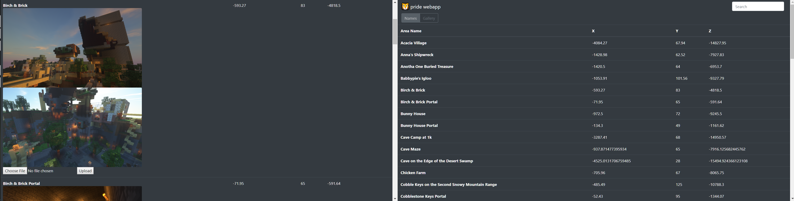

<h1 align="center">pride</h1>
<h3 align="center">🦁  keep track of your playmates in minecraft</h3>

<p align="center">
  <a href="https://github.com/insanj/pride/releases">
    
  </a>

  <a href="https://github.com/insanj/pride/">
    
  </a>

  <a href="https://github.com/insanj/pride/blob/master/LICENSE">
    
  </a>

  <a href="https://github.com/insanj/pride/releases/">
    
  </a>
  
  <br/>

  <a href="https://jdk.java.net/">
    
  </a>


  <a href="https://minecraft.net/">
    
  </a>
  
  <a href="https://maven.fabricmc.net/net/fabricmc/fabric">
    
  </a>

  <a href="https://fabricmc.net/use">
    
  </a>
  
  <a href="https://fabricmc.net/use">
    
  </a>
</p>

---

Pride is a suite of lightweight tools that help everyone on a Minecraft server. Built using the latest Fabric API and targeting the latest Minecraft snapshot, the core mod, `pride.jar`, only need to be installed on the server. Unlike most modpacks and tools, Pride lets you keep track of each other without the use of any dependancies (besides Fabric itself), and should not significantly alter the vanilla experience. Although relatively simple in its design, this plugin aims to be really useful and offer a nice supplement to the built-in navigation features of Minecraft.

<br/>

In addition to `pride.jar`, it is highly recommended that server runners use the Pride webapp, which allows for easy management of all features of Pride, and some added bonuses -- such as adding multiple screenshots to create a blog-like website which can be easily saved and exported to external publishing.

<br/>

Finally, some legacy users of Pride will need to convert from the old YAML formats to the new NBT format. There have been 3 substantially different formats in the history of Pride, each essential for powering the webapp and all `0.4.x` and beyond features. To convert from the old formats to the new formats, use 🐯 [tigon](https://github.com/insanj/tigon) and provide `?yaml` or `?json`  in the URL bar to switch versions.

---

## Playing

- `/areas <page_number>`
- `/settle <name>`
- `/abandon <name>`
- `/far <name>`
- `/here <optional:username>`
- `/between <name_1>, <name_2>`
- `/compass <optional:area>`
- `/north`

---

## Webapp

Pride is most useful when paired with its simple webapp, designed to be ran locally on your computer.

If your server can be accessed with FTP, drop the `host`, `user`, and `password` in a `.env` file in the root `/webapp` directory. 

When launched using `npm start` (make sure to run `npm install` beforehand), the webapp will download the `/plugins/pride/config.yml` automatically and use it along with its own local JSON file to power the website.



---

## Authors

```
Julian Weiss & Anna Raykovska
me@insanj.com
github.com/insanj
```

## License

See [LICENSE](https://github.com/insanj/pride/blob/master/LICENSE). (c) 2019 Julian Weiss.

